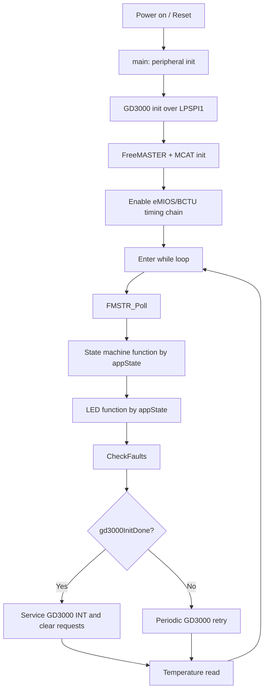
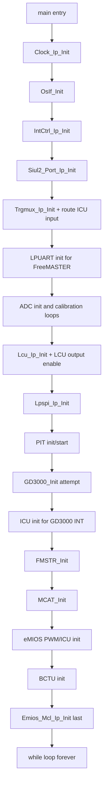
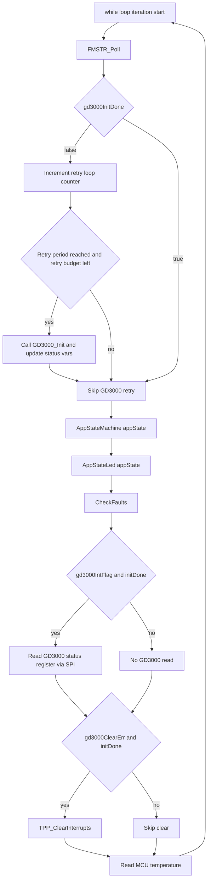
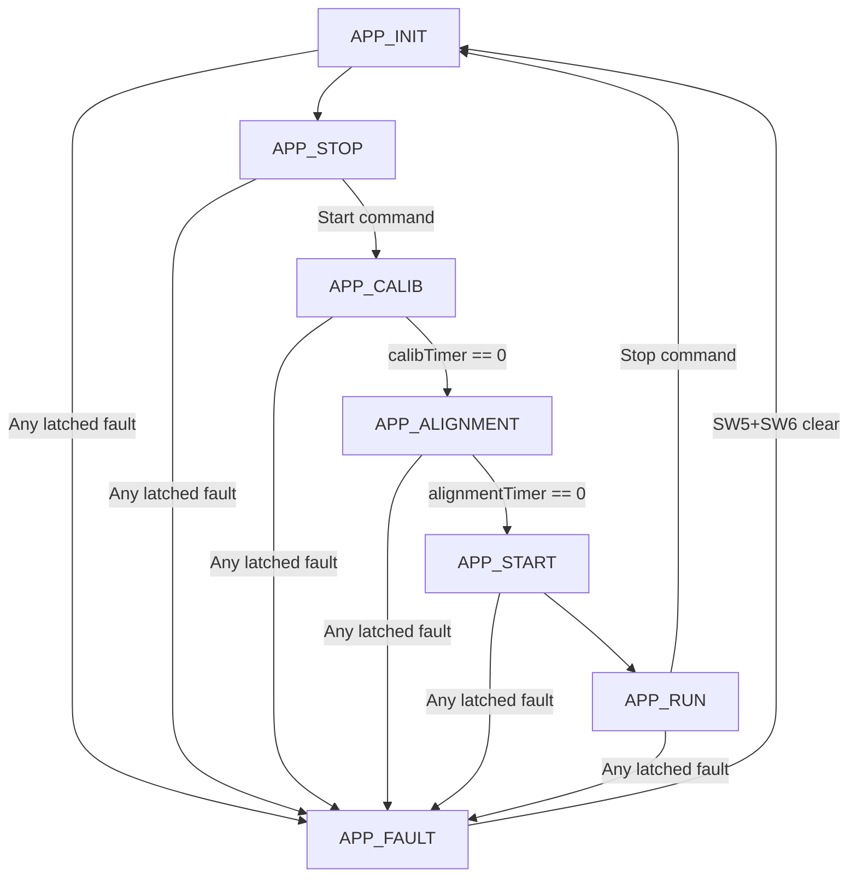
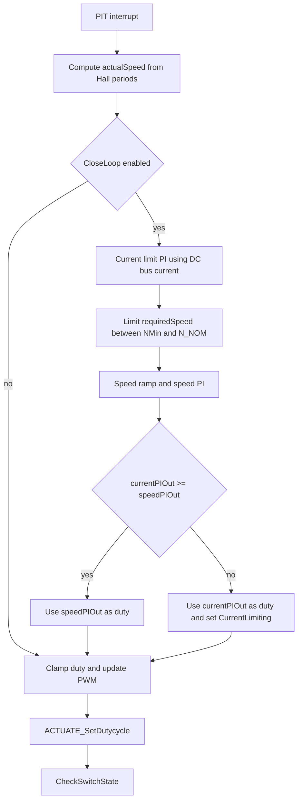
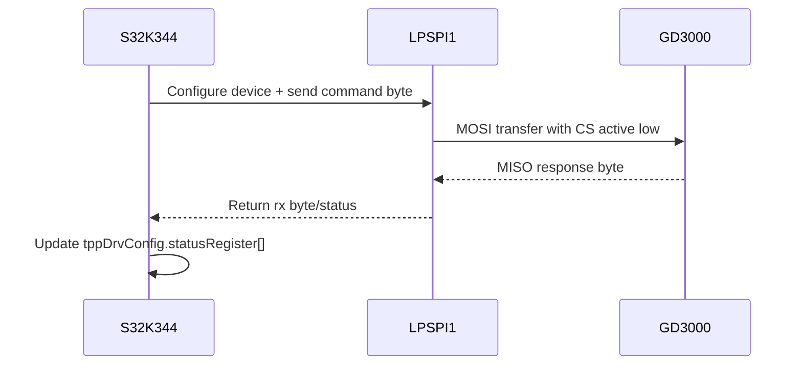
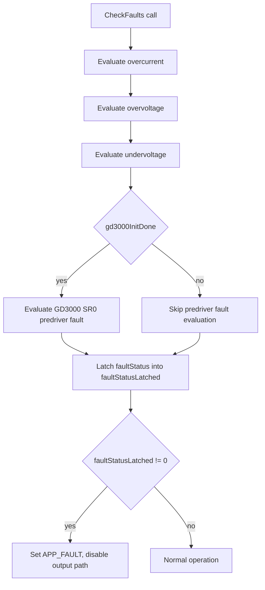

# MCSPTE1AK344 BLDC 6‑Step (Hall) — Project Walkthrough

This document explains **how the whole project works**, step-by-step, for someone who is new to the MCSPTE1AK344 kit and this codebase.

**Project folder:** `MCSPTE1AK344_BLDC_6Step_hall_ll`  
**Main file:** `src/main.c`  
**Kit:** S32K344 EVB + DEVKIT‑MOTORGD power stage (GD3000 predriver)

---

## 0. What this project does (1 paragraph)

This firmware runs a **3‑phase BLDC motor** using **six-step commutation** (trapezoidal control) with **Hall sensors** for rotor position. The MCU reads DC bus voltage/current and Hall timing, computes a duty cycle (throttle) using PI controllers, and outputs PWM/commutation signals to the power stage. A state machine controls the high-level behavior (Init → Stop → Calib → Alignment → Run → Fault). Fault logic stops the motor and turns the RGB LED red.

---

## 0.1 One-minute architecture view (for first-time readers)

Think of the project as 5 linked blocks:

1. **Power + hardware interface**: motor supply, GD3000 gate driver, MOSFET stage, Hall sensors.
2. **Initialization block**: MCU configures clocks, pins, ADC, PWM, SPI, and GD3000.
3. **Real-time measurement block**: interrupts continuously read current, voltage, and Hall timing.
4. **Control block**: PI controllers compute duty cycle and update PWM.
5. **Supervisory block**: state machine, buttons, LED states, and fault handling.

If any critical fault appears, supervisory logic forces **FAULT state**, disables output, and lights **red LED**.

---

## 0.2 End-to-end code flow diagram

**Node legend (0.2 diagram):**
- `A` reset/power-on, `B` peripheral init, `C` GD3000 init, `D` FreeMASTER+MCAT init, `E` timing chain enable
- `F` main loop entry, `G` FMSTR poll, `H` state machine step, `I` LED update, `J` fault check
- `K` GD3000 init decision, `L` GD3000 service path, `M` GD3000 retry path, `N` temperature read

### Detailed explanation (0.2 diagram)

- **A -> B:** After reset, MCU enters `main()` and initializes core drivers (clock, pins, interrupts, comms, ADC/PWM stack).
- **B -> C:** The predriver is configured by SPI. This step is critical because PWM power-stage commands are unsafe without valid gate-driver setup.
- **C -> D -> E:** Monitoring (FreeMASTER/MCAT) and timing chain (eMIOS/BCTU) are enabled so control data and triggers are live.
- **E -> F:** Firmware transitions from one-time setup to continuous runtime loop.
- **F -> G -> H -> I -> J:** Each loop iteration polls comms, executes current state logic, updates LED state, and evaluates faults.
- **J -> K:** If GD3000 is ready, service driver status/clear paths; otherwise, retry bring-up in background.
- **L/M -> N:** Loop ends with temperature housekeeping and restarts immediately.

---

## 1. Hardware blocks (what connects to what)

### 1.1 Main hardware components

- **S32K344 MCU (EVB board)**: runs the control algorithm, reads sensors, generates PWM.
- **DEVKIT‑MOTORGD power stage**: contains the **GD3000** gate driver and MOSFET half-bridges.
- **BLDC motor with Hall sensors**: provides 3 digital Hall signals (A/B/C).
- **Supply**: typically 12 V to the motor power stage (DC bus).

### 1.2 The most important MCU peripherals used

- **LPSPI1**: SPI link to GD3000 (predriver configuration + status).
- **ADC + BCTU**: measure DC bus voltage/current and phase currents (depending on configuration).
- **LCU + eMIOS PWM**: generate commutation/PWM signals and timing.
- **eMIOS ICU**: timestamps Hall events (for speed estimation).
- **PIT**: periodic control loop interrupt (speed/current control).
- **LPUART + FreeMASTER**: monitoring/tuning via PC tool.

---

## 2. Where to start reading the code

If you only read three files first:

1. **`src/main.c`** — everything is wired together here (init + interrupts + main loop + state machine + faults).
2. **`src/state_machine.c` / `src/state_machine.h`** — names and meaning of each application state.
3. **`src/config/BLDC_appconfig.h`** — key thresholds and tuning constants (voltage/current limits, PI gains, alignment time).

---

## 3. Program flow overview (big picture)

At a high level, the firmware runs in three “layers” at runtime:

1. **Interrupt layer (time-critical)**  
   - ADC / BCTU FIFO ISR: refreshes measurements frequently  
   - PIT ISR: runs the main control loop regularly  
   - eMIOS ICU ISR: timestamps Hall events → speed feedback  
   - GD3000 INT ISR: marks that GD3000 has an interrupt to read/clear

2. **Background loop layer (main `while(1)`)**  
   - FreeMASTER servicing  
   - Calls the application state machine function for the current state  
   - Updates LEDs  
   - Runs fault checks  
   - Services GD3000 status if needed

3. **State machine layer (high-level motor behavior)**  
   - Handles “what should happen now” (e.g., calibrate offset, align rotor, run motor, stop, fault).

---

## 3.1 Startup flowchart (exact init order)

**Node legend (3.1 startup diagram):**
- `S0` main entry, `S1` clock init, `S2` OSIF init, `S3` interrupt controller init
- `S4` pin mux init, `S5` TRGMUX/ICU route, `S6` UART init, `S7` ADC init+calib
- `S8` LCU/output init, `S9` LPSPI init, `S10` PIT init/start, `S11` GD3000 init
- `S12` GD3000 ICU init, `S13` FreeMASTER init, `S14` MCAT init, `S15` eMIOS init
- `S16` BCTU init, `S17` eMIOS MCL final start, `S18` enter endless runtime loop

### Detailed explanation (3.1 startup flowchart)

- **S0-S3:** Platform baseline init: clock, OS abstraction, interrupt controller.
- **S4:** Pin muxing binds each physical pin to GPIO, SPI, PWM, ICU, etc.
- **S5:** Trigger routing ensures peripheral timing paths are connected correctly.
- **S6-S7:** Communication and sensing come online; ADC calibration must succeed before using measurements.
- **S8-S10:** Actuation and control timing foundations are prepared (LCU, SPI, PIT).
- **S11-S12:** GD3000 initialization plus interrupt line setup for driver fault events.
- **S13-S16:** Debug/tuning and runtime capture modules are initialized (FreeMASTER, MCAT, eMIOS ICU/PWM, BCTU).
- **S17:** Final eMIOS MCL init starts timing chain in desired order.
- **S18:** Firmware enters infinite loop where all runtime behavior happens.

---

## 4. Step-by-step startup sequence (`main()`)

This is the order (conceptually) of what `main()` does in `src/main.c`:

### Step 4.1 Clock + OS abstraction

- Initializes the clock tree (`Clock_Ip_Init`)
- Initializes OSIF (`OsIf_Init`) used by some drivers

### Step 4.2 Interrupt controller

- Enables configured interrupts (`IntCtrl_Ip_Init`)

### Step 4.3 Pin muxing

- Configures all pins using the generated pin array:  
  `Siul2_Port_Ip_Init(NUM_OF_CONFIGURED_PINS0, g_pin_mux_InitConfigArr0);`

### Step 4.4 TRGMUX, UART, ADC init + calibration

- TRGMUX routing is initialized (`Trgmux_Ip_Init`)
- UART is initialized for FreeMASTER (LPUART6)
- ADC instances are initialized and calibrated (the code loops until `E_OK`)
- Temperature sensor is enabled

### Step 4.5 LCU + PWM routing enable

- LCU is initialized
- Outputs are enabled so commutation/PWM control can work

### Step 4.6 SPI + GD3000 initialization

- LPSPI is initialized
- GD3000 init is attempted (TPPSDK). The code tracks whether init is done (`gd3000InitDone`) and may retry later in the background loop.

### Step 4.7 FreeMASTER + application init

- FreeMASTER base address is set and FreeMASTER is initialized (`FMSTR_Init`)
- MCAT parameters and software structures are initialized (`MCAT_Init`)

### Step 4.8 eMIOS + BCTU init

- PWM and ICU are initialized
- Timestamp capture is started (for Hall period measurement)
- BCTU is initialized for measurement acquisition

### Step 4.9 Enter main loop

`while (1)` runs forever and orchestrates everything else.

---

## 4.10 Why eMIOS clock is enabled last

The code comment is important: eMIOS clock is enabled at the end to keep trigger order deterministic.  
Practical reason: if timing/peripheral trigger chain starts too early, some modules can begin sampling before all dependencies are configured.

---

## 5. The main loop (`while(1)`) — what happens repeatedly

Inside `while(1)` in `src/main.c`, this is the repeating sequence:

1. **`FMSTR_Poll()`**  
   Services FreeMASTER communications so you can view/tune variables.

2. **GD3000 init retry (only if not initialized)**  
   If `gd3000InitDone == false`, the code periodically retries `GD3000_Init()`.

3. **State machine**  
   `AppStateMachine[appState]();` runs the function for the current state.

4. **LED update**  
   `AppStateLed[appState]();` sets the RGB LED according to the state.

5. **Fault checks**  
   `CheckFaults();` updates fault bits and may force `APP_FAULT`.

6. **GD3000 interrupt service (if INT happened)**  
   If the GD3000 INT flag is set, read status registers through SPI.

7. **GD3000 clear-error service**  
   If software requested clear (e.g., user cleared faults), send clear commands.

8. **Temperature read (optional monitoring)**  
   Reads MCU die temperature and stores it.

---

## 5.1 Main loop flowchart

**Node legend (5.1 main-loop diagram):**
- `W0` loop start, `W1` FMSTR poll, `W2` GD3000 init-done check
- `W3/W4/W5` retry counter/condition/retry init, `W6` continue runtime path
- `W7` state machine call, `W8` LED update, `W9` fault check
- `W10/W11/W12` GD3000 INT decision/read/skip
- `W13/W14/W15` GD3000 clear decision/clear/skip
- `W16` temperature update then back to `W0`

### Detailed explanation (5.1 main loop flowchart)

- **W1:** Keeps host tool communication responsive (variables, tuning, recorder).
- **W2-W5:** Non-blocking GD3000 recovery strategy. If init is not done, retries occur periodically, not in a hard startup stall.
- **W7:** State machine runs exactly one state handler per loop (`INIT/STOP/CALIB/...`).
- **W8:** LED output is tied directly to state so user sees system mode immediately.
- **W9:** Protection logic runs every cycle and can force FAULT.
- **W10-W11:** GD3000 interrupt flag triggers SPI status read.
- **W13-W14:** Requested clear operations are sent to GD3000.
- **W16:** Temperature value is refreshed; loop restarts.

---

## 6. Application state machine (what the user experiences)

States are defined in `src/state_machine.h` and wired in `src/state_machine.c`:

- `APP_INIT` (0): reset software flags, disable PWM, go to STOP
- `APP_STOP` (5): wait for the user to start
- `APP_CALIB` (1): measure DC bus current offset for better current/torque estimate
- `APP_ALIGNMENT` (2): apply a fixed commutation pattern to align rotor
- `APP_START` (3): transition into RUN (in this Hall project, START is quick)
- `APP_RUN` (4): closed-loop running; user can change speed; if user stops, go back to INIT
- `APP_FAULT` (6): fault latched; motor outputs disabled; requires user clear action

### 6.1 User buttons (start / speed up / speed down / clear)

Handled in `CheckSwitchState()` in `src/main.c`:

- **SW5 (INC)**: start or increase required speed
- **SW6 (DEC)**: start or decrease required speed / change direction on first press
- **SW5 + SW6 together**: clear faults if in `APP_FAULT`

There is debounce and lockout timing (`SW_PRESS_DEBOUNCE`, `SW_PRESS_OFF`) to prevent accidental multiple triggers.

---

## 6.2 State transition flowchart

**Node legend (6.2 state diagram):**
- `I` APP_INIT, `STP` APP_STOP, `CAL` APP_CALIB, `ALN` APP_ALIGNMENT
- `STA` APP_START, `RUN` APP_RUN, `FLT` APP_FAULT

### Detailed explanation (6.2 state transition flowchart)

- **INIT -> STOP:** Always happens after software reset of control variables and PWM disable.
- **STOP -> CALIB:** Requires user start request (`appSwitchState` set by button logic).
- **CALIB -> ALIGN:** Triggered after current-offset calibration timer expires.
- **ALIGN -> START -> RUN:** Alignment timer expires, then control transitions into active closed-loop run path.
- **RUN -> INIT:** User stop command path sets flags that move system back to safe initialization.
- **Any state -> FAULT:** Faults are latched globally; once latched, system is forced to FAULT.
- **FAULT -> INIT:** Requires explicit user clear (SW5+SW6), then software clears latched faults and restarts sequence.

---

## 6.3 Button behavior (CW/CCW and speed) in plain words

The button logic in `CheckSwitchState()` works like this:

- **System in STOP / not running (`appSwitchState == 0`)**
  - Press **SW5**: set direction to **clockwise** and arm start (`appSwitchState = 1`).
  - Press **SW6**: set direction to **counterclockwise** and arm start (`appSwitchState = 1`).
- **System already armed/running (`appSwitchState != 0`)**
  - Press **SW5**: increase `requiredSpeed` by `SPEED_INC`.
  - Press **SW6**: decrease `requiredSpeed` by `SPEED_DEC`.
- **Press SW5 + SW6 together**
  - If in `APP_FAULT`: clear fault request.
  - In all cases: stop/disable command path by forcing `appSwitchState = 0`.

Important: software uses debounce counters and off-time counters, so presses must be long enough to register.

---

## 7. Interrupts (the real-time “engine”)

### 7.1 BCTU FIFO notification ISR (`BctuFifoNotif`)

Purpose: refresh measurements.

What it does (high level):

- Reads BCTU FIFO results into a buffer
- Updates DC bus voltage (`ADCResults.DCBVVoltage`)
- Updates DC bus current raw and filtered (`DCBIVoltageRaw`, `torque_filt`)
- Reads Hall sector inputs and updates `SensorHall.Sector`
- Decrements timers for calibration and alignment phases
- Records FreeMASTER data (`FMSTR_Recorder(0)`)

### 7.2 PIT ISR (`Pit1Notif`) — main control loop

Purpose: run speed/current control at a fixed periodic rate.

Key steps:

1. Compute **speed feedback** from summed Hall periods (`SensorHall.Period[]`).
2. If `driveStatus.B.CloseLoop == 1`, run:
   - current limiting PI (torque PI) based on DC bus current
   - speed PI based on ramped required speed
   - choose the smaller of speed PI / current PI to limit current
3. Clamp duty cycle and write it to PWM (`ACTUATE_SetDutycycle`).
4. Call `CheckSwitchState()` to process user inputs.

### 7.2.1 Speed control flowchart

**Node legend (7.2.1 speed-control diagram):**
- `P0` PIT ISR entry, `P1` speed calculation, `P2` close-loop decision
- `P3` current PI, `P4` speed limits, `P5` speed ramp+PI, `P6` arbitration decision
- `P7` use speed PI output, `P8` use current-limit PI output
- `P9` clamp duty, `P10` PWM update, `P11` button handling

### Detailed explanation (7.2.1 speed control flowchart)

- **P1:** Rotor speed estimate comes from Hall timestamp periods.
- **P2 branch:** If close-loop is disabled, controller skips PI math and only applies duty clamp/output.
- **P3:** Current PI acts as torque/current limiter using DC bus current feedback.
- **P4-P5:** Commanded speed is limited and ramped before speed PI computes demand.
- **P6 arbitration:** Lower of speed demand and current-limit demand is selected, preventing overcurrent while tracking speed.
- **P9-P10:** Duty is clamped to safe range and pushed to PWM hardware.
- **P11:** Button handling runs in the same PIT path so operator commands are responsive.

### 7.3 eMIOS ICU notify (`eMIOS1IcuNotify`) — Hall timing

Purpose: compute Hall period values from ICU timestamps.

It updates `SensorHall.Period[i]` by taking differences of timestamp captures.

### 7.4 GD3000 interrupt handler (`GD3000_INT_Handler`)

Purpose: minimal ISR that sets a flag.

It sets `gd3000Status.B.gd3000IntFlag = true;` and the main loop later reads GD3000 status over SPI.

---

## 7.5 Communication path detail (MCU <-> GD3000)

### 7.5.1 Runtime communication model

- The main loop does not constantly poll all GD3000 registers.
- Instead, GD3000 INT pin event sets a flag in ISR.
- Main loop sees that flag and reads status register(s) by SPI.
- Fault clear requests also go through SPI (`TPP_ClearInterrupts`).

### 7.5.2 Communication sequence flowchart

**Participant legend (7.5.2 sequence diagram):**
- `MCU` = S32K344 firmware code
- `SPI` = LPSPI1 peripheral/driver path
- `GD` = GD3000 predriver IC

### Detailed explanation (7.5.2 communication sequence)

- **MCU -> SPI:** Software prepares one command byte (command + subcommand/data nibble).
- **SPI -> GD:** With CS active low, one byte is transmitted on MOSI.
- **GD -> SPI:** GD3000 returns one byte on MISO for status/data feedback.
- **SPI -> MCU:** SPI driver reports transfer status and received byte.
- **MCU internal update:** Driver stores readback in software shadow registers and may trigger fault logic depending on bits.

---

## 8. Fault handling (why the LED turns red)

Fault logic is in `CheckFaults()` in `src/main.c`.

Fault sources include:

- **Over DC bus current** (`I_DCB_OVERCURRENT`)
- **Over DC bus voltage** (`U_DCB_OVERVOLTAGE`)
- **Under DC bus voltage** (`U_DCB_UNDERVOLTAGE`)
- **GD3000 predriver fault** (GD3000 status register 0 indicates events)

### 8.1 Latching behavior

- `faultStatus` contains current cycle faults
- `faultStatusLatched` ORs in faults and keeps them set until cleared
- If `faultStatusLatched != 0`, the firmware forces:
  - `appState = APP_FAULT`
  - PWM outputs disabled (`ACTUATE_DisableOutput()`)
  - RGB LED red (because `APP_FAULT` maps to red in `AppStateLed`)

### 8.2 Clearing faults

User action: press **SW5 + SW6 together** while in `APP_FAULT`.

This sets `faultSwitchClear`, and `AppFault()` resets:

- `faultStatus` and `faultStatusLatched`
- `driveStatus.B.Fault`
- state back to `APP_INIT`
- and requests GD3000 clear interrupts (`gd3000ClearErr = true`)

---

## 8.3 Fault decision flowchart

**Node legend (8.3 fault diagram):**
- `F0` CheckFaults entry
- `F1/F2/F3` overcurrent/overvoltage/undervoltage checks
- `F4` GD3000-ready gate, `F5` GD3000 predriver fault check, `F6` skip GD3000 check
- `F7` latch current faults
- `F8` latched-fault decision
- `F9` force FAULT state and disable outputs
- `F10` normal operation

### Detailed explanation (8.3 fault decision flowchart)

- **F1-F3:** Electrical protections (overcurrent, overvoltage, undervoltage) are evaluated first every cycle.
- **F4 gate:** Predriver fault check is executed only when GD3000 initialization is confirmed.
- **F7:** Current-cycle faults are OR-latched into `faultStatusLatched` so transient events are not lost.
- **F8 yes path:** Any latched bit forces FAULT state and disables actuation path.
- **F8 no path:** System remains in normal state flow.

---

## 9. Motor control behavior (what “six-step hall” means here)

Six-step commutation energizes two phases at a time (one high, one low) according to rotor sector.

In this project:

- Hall inputs determine the **sector**
- Commutation outputs are handled through LCU sync inputs/overrides and PWM channels
- Duty cycle controls average voltage → controls speed/torque

Rotor alignment forces a known energization pattern for a fixed duration so the initial sector is controlled.

---

## 9.1 Sector and commutation concept (simple explanation)

- Hall sensors generate 3-bit patterns as rotor moves.
- Each valid Hall pattern maps to one electrical sector.
- For each sector, firmware drives one phase high, one low, one floating (six-step pattern).
- PWM duty controls the effective voltage applied in that active sector.
- As sectors change, commutation advances in sync with rotor.

---

## 10. Configuration values you will most often tune

File: `src/config/BLDC_appconfig.h`

Typical things to adjust:

- `U_DCB_UNDERVOLTAGE`, `U_DCB_OVERVOLTAGE`
- `I_DCB_OVERCURRENT`, `I_DCB_LIMIT`
- PI gains: `SPEED_LOOP_KP_GAIN`, `SPEED_LOOP_KI_GAIN`, `TORQUE_LOOP_KP_GAIN`, `TORQUE_LOOP_KI_GAIN`
- Alignment: `ALIGN_VOLTAGE`, `ALIGN_DURATION`
- Minimum speed: `N_MIN`

---

## 11. Quick “how to run it” checklist (for a new user)

1. Power the kit correctly (EVB + motor shield seated, DC supply connected).
2. Build and flash the `Debug_FLASH` configuration.
3. After reset:
   - Green flashing states indicate calibration/alignment/start
   - Blue/green states indicate running/stopped (depending on mapping)
   - Red LED means fault latched
4. Press **SW5** to start/increase speed (or SW6 for opposite direction/start).
5. If red LED: press **SW5 + SW6** to clear faults, then start again.
6. Use FreeMASTER/MCAT to observe `appState`, `faultStatus`, `ADCResults`, and speed variables.

---

## 11.1 Quick variable watch list for review

- `appState` (current state)
- `requiredSpeed`, `actualSpeed`, `duty_cycle`
- `faultStatus.R`, `faultStatusLatched.R`
- `ADCResults.DCBVVoltage`, `ADCResults.DCBIVoltage`
- `gd3000Status.B.gd3000InitDone`
- `tppDrvConfig.deviceConfig.statusRegister[0]`

This gives a full story: command -> control -> output -> fault guard.

---

## 12. Where to look next (deeper reading)

- Measurement scaling: `src/meas_s32k.c`
- Actuation/PWM and commutation: `src/actuate_s32k.c`
- GD3000 driver stack:
  - `TPPSDK_GD3000_Driver/gd3000_init.c`
  - `TPPSDK_GD3000_Driver/tpp/tpp.c`

